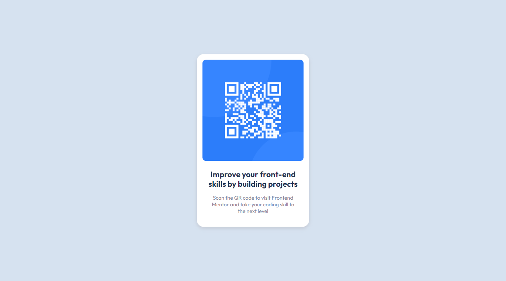

# Frontend Mentor - QR code component solution

This is a solution to the [QR code component challenge on Frontend Mentor](https://www.frontendmentor.io/challenges/qr-code-component-iux_sIO_H). Frontend Mentor challenges help you improve your coding skills by building realistic projects. 

## Table of contents

- [Overview](#overview)
  - [Screenshot](#screenshot)
  - [Links](#links)
- [My process](#my-process)
  - [Built with](#built-with)
  - [What I learned](#what-i-learned)
- [Author](#author)
- [Acknowledgments](#acknowledgments)

**Note: Delete this note and update the table of contents based on what sections you keep.**

## Overview

### Screenshot

### Links

- Live Site URL: [QR code component solution](https://qr-code-component.dodeun.com/)

## My process

### Built with

- Semantic HTML5 markup
- CSS custom properties
- Flexbox
- SCSS
- Mobile-first workflow

### What I learned

List of things I learned doing this project:

  * Install and navigate WSL 2
  * Install Apach 2, setup virtual hosts
  * Create a git repository
  * Add , commit push on the main branch of a git project
  * Install Gulp
  * Compile SCSS into CSS with Gulp
  * Use of localhost:3000
  * Discovery of Web hosting services and deployment of my solution to this project

I have just brushed the surface of all those topics, learning just enough to get me started.

## Author

- Frontend Mentor - [@Dodeun](https://www.frontendmentor.io/profile/Dodeun)

## Acknowledgments

This project has been used as the first step to learn how to work with Git repositories, Wsl , Gulp and Web hosting services. I was able to learn all this thanks to a good friend of mine.
